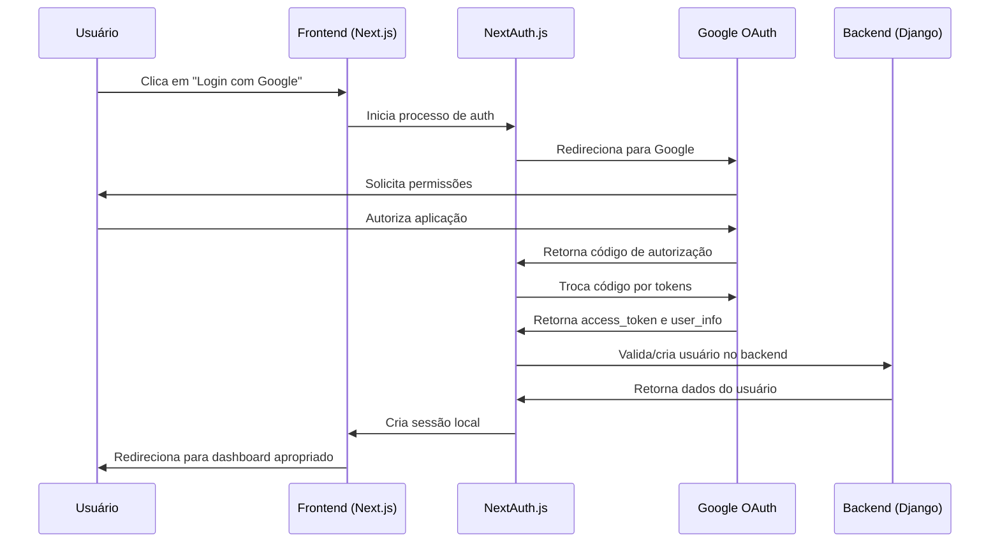
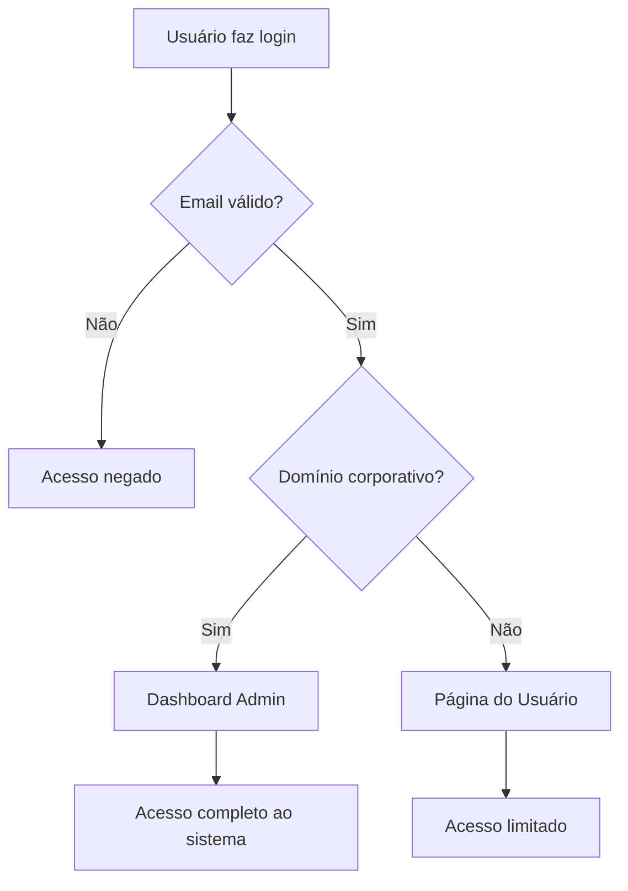

# Arquitetura de Autenticação - Conflu

## Visão Geral

O sistema de autenticação do Conflu utiliza **Google OAuth** como único método de login, com controle de acesso baseado no domínio do email para diferenciar entre administradores e usuários comuns.

## Tecnologias Utilizadas

- **NextAuth.js v5**: Gerenciamento de autenticação no frontend
- **Google OAuth 2.0**: Provedor de autenticação
- **JWT**: Tokens para comunicação com backend
- **Django REST Framework**: Validação de tokens no backend

## Fluxo de Autenticação

### 1. Login Flow


### 2. Controle de Acesso


## Configuração NextAuth.js

### Instalação
```bash
npm install next-auth
npm install @auth/prisma-adapter  # Se usar Prisma
```

### Configuração Base
```typescript
// app/api/auth/[...nextauth]/route.ts
import NextAuth from "next-auth"
import GoogleProvider from "next-auth/providers/google"

const handler = NextAuth({
  providers: [
    GoogleProvider({
      clientId: process.env.GOOGLE_CLIENT_ID!,
      clientSecret: process.env.GOOGLE_CLIENT_SECRET!,
    })
  ],
  callbacks: {
    async signIn({ user, account, profile }) {
      // Validar domínio do email
      const allowedDomains = [
        process.env.CORPORATE_DOMAIN, // Ex: "empresa.com"
        "gmail.com", // Usuários comuns
        "hotmail.com",
        // outros domínios permitidos
      ]
      
      const emailDomain = user.email?.split('@')[1]
      return allowedDomains.includes(emailDomain || '')
    },
    
    async jwt({ token, user, account }) {
      if (user) {
        token.role = getUserRole(user.email)
        token.accessToken = account?.access_token
      }
      return token
    },
    
    async session({ session, token }) {
      session.user.role = token.role
      session.accessToken = token.accessToken
      return session
    }
  },
  pages: {
    signIn: '/auth',
    error: '/auth/error',
  }
})

function getUserRole(email: string): 'admin' | 'user' {
  const domain = email?.split('@')[1]
  return domain === process.env.CORPORATE_DOMAIN ? 'admin' : 'user'
}

export { handler as GET, handler as POST }
```

### Middleware de Proteção
```typescript
// middleware.ts
import { withAuth } from "next-auth/middleware"

export default withAuth(
  function middleware(req) {
    // Lógica adicional se necessário
  },
  {
    callbacks: {
      authorized: ({ token, req }) => {
        const { pathname } = req.nextUrl
        
        // Rotas públicas
        if (pathname.startsWith('/auth')) return true
        
        // Rotas admin
        if (pathname.startsWith('/admin')) {
          return token?.role === 'admin'
        }
        
        // Rotas do usuário
        if (pathname.startsWith('/dashboard')) {
          return !!token
        }
        
        return true
      },
    },
  }
)

export const config = {
  matcher: ['/admin/:path*', '/dashboard/:path*']
}
```

## Configuração do Backend Django

### Instalação
```bash
pip install djangorestframework-simplejwt
pip install google-auth
pip install requests
```

### Settings
```python
# settings.py
INSTALLED_APPS = [
    # ...
    'rest_framework_simplejwt',
]

REST_FRAMEWORK = {
    'DEFAULT_AUTHENTICATION_CLASSES': [
        'authentication.backends.NextAuthBackend',
    ],
    'DEFAULT_PERMISSION_CLASSES': [
        'rest_framework.permissions.IsAuthenticated',
    ],
}

# Google OAuth Settings
GOOGLE_CLIENT_ID = os.getenv('GOOGLE_CLIENT_ID')
CORPORATE_DOMAIN = os.getenv('CORPORATE_DOMAIN')  # Ex: "empresa.com"
```

### Custom Authentication Backend
```python
# authentication/backends.py
from rest_framework.authentication import BaseAuthentication
from rest_framework.exceptions import AuthenticationFailed
from django.contrib.auth.models import User
import requests
import jwt

class NextAuthBackend(BaseAuthentication):
    def authenticate(self, request):
        auth_header = request.META.get('HTTP_AUTHORIZATION')
        if not auth_header or not auth_header.startswith('Bearer '):
            return None
            
        token = auth_header.split(' ')[1]
        
        try:
            # Validar token JWT do NextAuth
            payload = jwt.decode(token, options={"verify_signature": False})
            email = payload.get('email')
            
            if not email:
                raise AuthenticationFailed('Token inválido')
            
            # Buscar ou criar usuário
            user, created = User.objects.get_or_create(
                email=email,
                defaults={
                    'username': email,
                    'first_name': payload.get('name', '').split(' ')[0],
                    'last_name': ' '.join(payload.get('name', '').split(' ')[1:]),
                }
            )
            
            # Definir permissões baseadas no domínio
            domain = email.split('@')[1]
            user.is_staff = domain == settings.CORPORATE_DOMAIN
            user.is_superuser = domain == settings.CORPORATE_DOMAIN
            user.save()
            
            return (user, token)
            
        except jwt.InvalidTokenError:
            raise AuthenticationFailed('Token inválido')
```

### User Model Extension
```python
# authentication/models.py
from django.contrib.auth.models import AbstractUser
from django.db import models

class CustomUser(AbstractUser):
    google_id = models.CharField(max_length=100, unique=True, null=True)
    avatar_url = models.URLField(null=True, blank=True)
    role = models.CharField(
        max_length=10,
        choices=[('admin', 'Admin'), ('user', 'User')],
        default='user'
    )
    
    def is_admin(self):
        return self.role == 'admin'
    
    def is_corporate_user(self):
        domain = self.email.split('@')[1] if self.email else ''
        return domain == settings.CORPORATE_DOMAIN
```

## Estrutura de Rotas

### Frontend Routes
```
/auth                 # Página de login
/auth/error          # Página de erro de auth
/admin/*             # Dashboard administrativo (apenas admins)
/dashboard/*         # Área do usuário comum
/api/auth/*          # Endpoints NextAuth
```

### Backend Endpoints
```
/api/auth/verify/    # Verificar token
/api/auth/profile/   # Perfil do usuário
/api/admin/*         # Endpoints administrativos
/api/user/*          # Endpoints do usuário
```

## Variáveis de Ambiente

### Frontend (.env.local)
```env
NEXTAUTH_URL=http://localhost:3000
NEXTAUTH_SECRET=sua-chave-secreta-super-forte

GOOGLE_CLIENT_ID=seu-google-client-id
GOOGLE_CLIENT_SECRET=seu-google-client-secret

CORPORATE_DOMAIN=empresa.com
NEXT_PUBLIC_API_URL=http://localhost:8000/api
```

### Backend (.env)
```env
GOOGLE_CLIENT_ID=seu-google-client-id
CORPORATE_DOMAIN=empresa.com
NEXTAUTH_SECRET=sua-chave-secreta-super-forte
```

## Configuração Google OAuth

### 1. Google Cloud Console
1. Acesse [Google Cloud Console](https://console.cloud.google.com/)
2. Crie um novo projeto ou selecione existente
3. Ative a Google+ API
4. Crie credenciais OAuth 2.0

### 2. Configurações OAuth
```
Authorized JavaScript origins:
- http://localhost:3000 (desenvolvimento)
- https://seudominio.com (produção)

Authorized redirect URIs:
- http://localhost:3000/api/auth/callback/google
- https://seudominio.com/api/auth/callback/google
```

## Componentes de Autenticação

### Login Button
```tsx
// components/auth/login-button.tsx
'use client'
import { signIn } from "next-auth/react"
import { Button } from "@/components/ui/button"
import { Chrome } from "lucide-react"

export function LoginButton() {
  return (
    <Button 
      onClick={() => signIn('google', { callbackUrl: '/dashboard' })}
      className="w-full"
    >
      <Chrome className="mr-2 h-4 w-4" />
      Entrar com Google
    </Button>
  )
}
```

### Session Provider
```tsx
// app/layout.tsx
import { SessionProvider } from "next-auth/react"

export default function RootLayout({
  children,
}: {
  children: React.ReactNode
}) {
  return (
    <html lang="pt-BR">
      <body>
        <SessionProvider>
          {children}
        </SessionProvider>
      </body>
    </html>
  )
}
```

### Protected Route Hook
```tsx
// hooks/use-auth.ts
import { useSession } from "next-auth/react"
import { useRouter } from "next/navigation"
import { useEffect } from "react"

export function useAuth(requireAdmin = false) {
  const { data: session, status } = useSession()
  const router = useRouter()

  useEffect(() => {
    if (status === 'loading') return

    if (!session) {
      router.push('/auth')
      return
    }

    if (requireAdmin && session.user.role !== 'admin') {
      router.push('/dashboard')
      return
    }
  }, [session, status, requireAdmin, router])

  return {
    user: session?.user,
    isLoading: status === 'loading',
    isAuthenticated: !!session,
    isAdmin: session?.user?.role === 'admin'
  }
}
```

## Controle de Acesso por Componente

### Admin Guard
```tsx
// components/auth/admin-guard.tsx
'use client'
import { useAuth } from "@/hooks/use-auth"
import { LoadingSpinner } from "@/components/ui/loading-spinner"

interface AdminGuardProps {
  children: React.ReactNode
  fallback?: React.ReactNode
}

export function AdminGuard({ children, fallback }: AdminGuardProps) {
  const { isLoading, isAdmin } = useAuth(true)

  if (isLoading) {
    return <LoadingSpinner />
  }

  if (!isAdmin) {
    return fallback || <div>Acesso negado</div>
  }

  return <>{children}</>
}
```

### User Guard
```tsx
// components/auth/user-guard.tsx
'use client'
import { useAuth } from "@/hooks/use-auth"
import { LoadingSpinner } from "@/components/ui/loading-spinner"

interface UserGuardProps {
  children: React.ReactNode
}

export function UserGuard({ children }: UserGuardProps) {
  const { isLoading, isAuthenticated } = useAuth()

  if (isLoading) {
    return <LoadingSpinner />
  }

  if (!isAuthenticated) {
    return null // Middleware já redirecionou
  }

  return <>{children}</>
}
```

## API Client com Autenticação

### HTTP Client
```typescript
// lib/api-client.ts
import { getSession } from "next-auth/react"

class ApiClient {
  private baseURL = process.env.NEXT_PUBLIC_API_URL

  async request(endpoint: string, options: RequestInit = {}) {
    const session = await getSession()
    
    const headers = {
      'Content-Type': 'application/json',
      ...options.headers,
    }

    if (session?.accessToken) {
      headers['Authorization'] = `Bearer ${session.accessToken}`
    }

    const response = await fetch(`${this.baseURL}${endpoint}`, {
      ...options,
      headers,
    })

    if (!response.ok) {
      throw new Error(`API Error: ${response.status}`)
    }

    return response.json()
  }

  get(endpoint: string) {
    return this.request(endpoint)
  }

  post(endpoint: string, data: any) {
    return this.request(endpoint, {
      method: 'POST',
      body: JSON.stringify(data),
    })
  }

  put(endpoint: string, data: any) {
    return this.request(endpoint, {
      method: 'PUT',
      body: JSON.stringify(data),
    })
  }

  delete(endpoint: string) {
    return this.request(endpoint, {
      method: 'DELETE',
    })
  }
}

export const apiClient = new ApiClient()
```

## Testes de Autenticação

### Frontend Tests
```typescript
// __tests__/auth/login.test.tsx
import { render, screen } from '@testing-library/react'
import { SessionProvider } from 'next-auth/react'
import { LoginButton } from '@/components/auth/login-button'

const mockSession = {
  user: { email: 'test@empresa.com', role: 'admin' },
  expires: '2024-12-31'
}

describe('LoginButton', () => {
  it('renders login button', () => {
    render(
      <SessionProvider session={null}>
        <LoginButton />
      </SessionProvider>
    )
    
    expect(screen.getByText('Entrar com Google')).toBeInTheDocument()
  })
})
```

### Backend Tests
```python
# tests/test_authentication.py
from django.test import TestCase
from django.contrib.auth import get_user_model
from rest_framework.test import APIClient
import jwt

User = get_user_model()

class AuthenticationTest(TestCase):
    def setUp(self):
        self.client = APIClient()
        
    def test_admin_access(self):
        # Criar token para admin
        payload = {
            'email': 'admin@empresa.com',
            'name': 'Admin User'
        }
        token = jwt.encode(payload, 'secret', algorithm='HS256')
        
        self.client.credentials(HTTP_AUTHORIZATION=f'Bearer {token}')
        response = self.client.get('/api/admin/dashboard/')
        
        self.assertEqual(response.status_code, 200)
        
    def test_user_access_denied_to_admin(self):
        payload = {
            'email': 'user@gmail.com',
            'name': 'Regular User'
        }
        token = jwt.encode(payload, 'secret', algorithm='HS256')
        
        self.client.credentials(HTTP_AUTHORIZATION=f'Bearer {token}')
        response = self.client.get('/api/admin/dashboard/')
        
        self.assertEqual(response.status_code, 403)
```

## Segurança

### Boas Práticas Implementadas
1. **HTTPS obrigatório em produção**
2. **Tokens JWT com expiração**
3. **Validação de domínio de email**
4. **CORS configurado adequadamente**
5. **Rate limiting nos endpoints de auth**

### Configurações de Segurança
```python
# settings.py (produção)
SECURE_SSL_REDIRECT = True
SECURE_HSTS_SECONDS = 31536000
SECURE_HSTS_INCLUDE_SUBDOMAINS = True
SECURE_HSTS_PRELOAD = True
SECURE_CONTENT_TYPE_NOSNIFF = True
SECURE_BROWSER_XSS_FILTER = True
X_FRAME_OPTIONS = 'DENY'
```

## Monitoramento

### Logs de Autenticação
```python
# authentication/logging.py
import logging

auth_logger = logging.getLogger('authentication')

def log_login_attempt(email, success, ip_address):
    if success:
        auth_logger.info(f"Login successful: {email} from {ip_address}")
    else:
        auth_logger.warning(f"Login failed: {email} from {ip_address}")

def log_access_denied(email, resource, ip_address):
    auth_logger.warning(f"Access denied: {email} to {resource} from {ip_address}")
```

### Métricas Importantes
- Taxa de login bem-sucedido
- Tentativas de acesso negado
- Usuários ativos por tipo (admin/user)
- Tempo de sessão médio

## Próximos Passos

### Implementação Imediata
1. Configurar Google OAuth no Google Cloud Console
2. Instalar e configurar NextAuth.js
3. Implementar backend de autenticação Django
4. Criar componentes de proteção de rotas

### Melhorias Futuras
1. **2FA**: Autenticação de dois fatores
2. **SSO**: Single Sign-On corporativo
3. **Audit Log**: Log detalhado de ações
4. **Session Management**: Controle avançado de sessões